**Corpor-Eat - Producto Mínimo Navegable (PMN)**  
*Prototipo de demostración para un sistema de reservas de restaurantes corporativos.*


---

## 📌 Descripción

`corpor-eat-pmn` es una maqueta funcional que simula un flujo real de reserva de restaurantes para empresas, enfocado en:

- Demostraciones funcionales de un sistema de reservas
- Pruebas de navegación de usuarios
- Ejemplo de integración de autenticación básica
- Simulación de flujo de pagos y administración

**Características principales:**
✅ Simulación de login de usuarios  
✅ Visualización de restaurantes con detalle emergente  
✅ Sistema de reservas con validaciones  
✅ Navegación protegida según autenticación  
✅ Página de pago funcional (PMN)  
✅ Accesos rápidos a Políticas, Términos y FAQ

---

## 🏗️ Estructura del Proyecto

```bash
corpor-eat-pmn/
├── public/
│   └── favicon.ico
├── src/
│   ├── assets/
│   │   └── main.css
│   ├── components/
│   │   ├── BigRestaurantCard.vue
│   │   ├── Footer.vue
│   │   ├── Mainlayout.vue
│   │   ├── Navbar.vue
│   │   ├── RestaurantDetailPopup.vue
│   │   └── SmallRestaurantCard.vue
│   ├── data/
│   │   ├── restaurants.json
│   │   └── users.json
│   ├── router/
│   │   └── index.ts
│   ├── stores/
│   │   └── user.ts
│   ├── views/
│   │   ├── AdminView.vue
│   │   ├── AuthView.vue
│   │   ├── FaqView.vue
│   │   ├── HomeView.vue
│   │   ├── PaymentView.vue
│   │   ├── PrivacyPolicyView.vue
│   │   ├── ReservationsView.vue
│   │   ├── RestaurantsView.vue
│   │   └── TermsOfServiceView.vue
│   ├── App.vue
│   └── main.ts
├── .gitignore
├── biome.jsonc
├── bun.lockb
├── env.d.ts
├── index.html
├── package.json
├── shell.nix
├── tsconfig.app.json
├── tsconfig.json
├── tsconfig.node.json
└── vite.config.ts
```

---

## 🗺️ Boceto de Navegación



```mermaid
graph TD
    A[HomeView] -->|Reservar Restaurante| B[RestaurantDetailPopup]
    B -->|Confirmar Reserva| C[PaymentView]

    A -->|Ver Restaurantes| D[RestaurantsView]
    A -->|Mis Reservas| E[ReservationsView]

    D -->|Seleccionar Restaurante| B
    E -->|Acceso Protegido| F[AuthView]

    F -->|Autenticarse| A

    A -->|Footer| G[PrivacyPolicyView]
    A -->|Footer| H[TermsOfServiceView]
    A -->|Footer| I[FaqView]

    A -->|Acceso Admin| J[AdminView]

    style A fill:#42b883,stroke:#2c3e50
    style B fill:#35495e,stroke:#42b883
    style C fill:#f39c12,stroke:#d35400
    style D fill:#3498db,stroke:#2980b9
    style E fill:#8e44ad,stroke:#9b59b6
    style F fill:#e74c3c,stroke:#c0392b
    style G fill:#95a5a6,stroke:#7f8c8d
    style H fill:#95a5a6,stroke:#7f8c8d
    style I fill:#95a5a6,stroke:#7f8c8d
    style J fill:#34495e,stroke:#2c3e50
```

**Leyenda:**
- 🟩 **HomeView:** Página principal de navegación.
- 🟦 **RestaurantsView:** Exploración de restaurantes.
- 🟪 **ReservationsView:** Página de reservas (protegida por login).
- 🟥 **AuthView:** Página de autenticación.
- 🟧 **PaymentView:** Confirmación de pago.
- 🛡️ **AdminView:** Acceso administrativo simulado.
- ⚪ **Vías de acceso (footer):** Políticas, Términos y Preguntas Frecuentes.

---

## 🛠️ Instalación y Desarrollo

### Requisitos:
- Node.js v18+ / Bun v1.x
- Yarn o Bun

### Pasos:
```bash
# Clonar el repositorio
git clone https://github.com/tuusuario/corpor-eat-pmn.git
cd corpor-eat-pmn

# Instalar dependencias
bun install

# Iniciar el servidor de desarrollo
bun run dev
```
